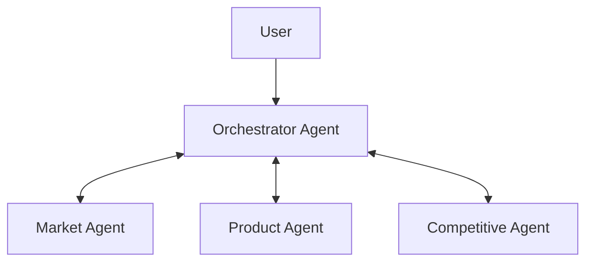

# Innovera Linked Agents Prototype

## Implementation Plan for the European Coffee Entry Demo

**Artifact:** Standalone scripted web prototype
**Audience:** Innovera leadership
**Presentation length:** Approximately five minutes
**Data status:** Entirely synthetic and fabricated for demonstration
**Primary purpose:** Validate whether an iterative, orchestrated network of specialist agents is understandable, credible, and strategically compelling before investing in a live multi-agent implementation

---

## 1. Executive Summary

Build a polished standalone web application that demonstrates four linked Innovera agents working together on a fictional European coffee market-entry decision:

* Orchestrator Agent
* Market Agent
* Product Agent
* Competitive Agent

The Orchestrator receives the user's venture brief, creates comparable strategic candidates, sends a distinct plan to each specialist, receives their reports, reconciles conflicts, asks the user one material strategic question, and sends revised plans back to the specialists. The second research round culminates in a final recommendation.

The experience must visibly prove three ideas:

1. Each specialist has a distinct charter, capabilities, assignment, and output.
2. One specialist's findings affect the next assignment given to the others.
3. The Orchestrator preserves user constraints while iteratively moving the system toward a decision.

This is a validation prototype, not a production agent system. All plans, reports, data, resources, scores, transitions, and recommendations are deterministic fixtures. There are no live model calls, research calls, databases, authentication flows, or backend services.

The prototype should be styled in Innovera's visual language: warm off-white surfaces, charcoal typography, Innovera coral, deep navy contrast panels, restrained blue/gold/pink accents, lightweight large headings, compact uppercase labels, generous spacing, rounded pill actions, and precise motion.

---

## 2. Product Decisions Already Made

These decisions are fixed for V1:

| Decision                     | Choice                                                      |
| ---------------------------- | ----------------------------------------------------------- |
| Delivery                     | Standalone web application                                  |
| Visual direction             | Styled like Innovera                                        |
| Runtime behavior             | Entirely scripted and deterministic                         |
| Presentation format          | Five-minute guided demonstration                            |
| Primary venture              | European Coffee Entry                                       |
| Agent topology               | One Orchestrator and three specialists                      |
| Specialist agents            | Market, Product, Competitive                                |
| Communication pattern        | Specialists communicate through the Orchestrator            |
| Research status              | Clearly labeled synthetic demonstration data                |
| Primary scenario             | Italy is a locked target market                             |
| User intervention            | One strategic priority question                             |
| Research rounds              | Two                                                         |
| Optional closing interaction | Change the market and show the existing work becoming stale |

Do not reopen these decisions during implementation unless the user explicitly requests a change.

---

## 3. Demo Thesis

The prototype is not trying to prove that four animated cards can exchange messages. It is trying to prove that orchestrated specialist intelligence creates a better decision than a single linear report.

The five-minute story should communicate:

> The obvious product has the strongest demand and is easiest to produce, but competition is brutal. The emptiest whitespace has weak underlying demand. By linking Market, Product, and Competitive analysis, the Orchestrator finds a more balanced opportunity and directs a second round of targeted work to validate it.

The strategic conclusion is:

> Launch a 250g premium medium-roast whole-bean coffee for younger urban Italian home-espresso consumers, positioned around traceable origin and modern Italian coffee culture.

The conclusion is less important than the process that produces it.

---

## 4. Success Criteria

The prototype succeeds if a viewer can answer all of these questions after one five-minute demonstration:

1. What is the Orchestrator responsible for?
2. How are the three specialist agents different?
3. What information did each specialist return?
4. Where did the agents disagree?
5. Why did the Orchestrator ask the user a question?
6. How did the user's answer change the next plans?
7. Which findings from one agent affected another agent's assignment?
8. Why was the final product selected?
9. What happens if a locked strategic lever changes?
10. How could this become an optimization system later?

The prototype should feel like a credible product concept, not a slideshow and not a theatrical simulation of hidden model thoughts.

---

## 5. Scope and Non-Goals

### 5.1 In Scope

* A polished desktop-first web interface
* Four visually distinct agents
* A canonical venture-state panel
* A guided two-round research workflow
* Distinct Orchestrator plans for every specialist
* Distinct structured reports from every specialist
* Visible plan and report transmission
* Agent status changes
* A candidate comparison scorecard
* One user decision point
* Causal references explaining why second-round plans changed
* A final recommendation
* A presentation-friendly reset control
* An optional market-change demonstration
* Responsive behavior sufficient for laptop presentation
* Reduced-motion and keyboard-accessible behavior
* Deterministic unit tests for core orchestration logic

### 5.2 Out of Scope

* Live LLM calls
* Live web research
* Real market claims
* Real optimization
* Real subagent processes
* Authentication
* Persistence across browser sessions
* Backend services
* Databases
* User accounts
* Full Innovera platform navigation
* Report export
* Direct specialist-to-specialist chat
* Free-form chat input
* Autonomous looping without presenter control
* Mobile-first design
* Production analytics or observability
* Raw chain-of-thought or simulated private reasoning

---

## 6. Fictional Venture Scenario

### 6.1 Venture Brief

An established North American specialty coffee roaster wants to enter Europe with one packaged, shelf-stable coffee product.

The company:

* Already owns conventional coffee roasting and packaging equipment
* Can produce light, medium, or dark roasts
* Can package whole-bean or ground coffee
* Can outsource capsules, but at materially greater complexity
* Wants a premium position
* Has limited appetite for new capital expenditure
* Will initially use premium grocery and direct-to-consumer channels
* Wants one launch market and one initial SKU

### 6.2 Initial User Instruction

Use this as the venture brief shown on screen:

> Identify the strongest packaged-coffee entry strategy for Europe. Italy is our required launch market. We want a premium product, one initial SKU, and minimal new manufacturing complexity.

### 6.3 Constraint Classification

The Orchestrator visibly converts the brief into:

#### Locked constraints

* Target market: Italy
* Initial SKU count: One
* Product type: Packaged, shelf-stable coffee
* Manufacturing: Existing equipment wherever possible
* Channels: Premium grocery and DTC

#### Soft preferences

* Premium positioning
* Balanced appetite for risk
* Meaningful differentiation

#### Open decisions

* Roast profile
* Whole bean versus ground
* Precise customer segment
* Positioning and product claim
* Pack size

### 6.4 Synthetic Data Disclaimer

A persistent but unobtrusive label must appear in the application:

> Synthetic demonstration — all research, scores, rankings, sources, and recommendations are fabricated.

If recognizable real competitor names are used for familiarity, never imply that the ranking or analysis is real. The disclaimer must remain visible.

---

## 7. Agent Definitions

## 7.1 Orchestrator Agent

### Permanent charter

Transform the user's strategic intent into a structured, evidence-seeking, iterative decision process.

### Owns

* Canonical venture state
* Constraint classification
* Candidate registry
* Round planning
* Specialist task assignment
* Report validation
* Cross-agent synthesis
* Conflict detection
* User questions
* Candidate scoring
* Convergence decision
* Final recommendation
* State versioning

### Does not own

* Detailed market research
* Detailed product feasibility work
* Detailed competitive research

### Visible capabilities

* Constraint extraction
* Candidate generation
* Research planning
* Cross-agent synthesis
* Conflict detection
* Strategy scoring
* Decision explanation

### Visual identity

* Primary color: Innovera coral
* Largest node
* Central position
* Distinct double-ring or halo treatment
* Status language should emphasize planning, synthesis, and decisions

---

## 7.2 Market Agent

### Permanent charter

Determine whether meaningful customers exist for a candidate strategy, what they value, how they behave, and how strongly the candidate fits the target market.

### Owns

* Demand intensity
* Customer segments
* Preparation behavior
* Roast and format preference
* Premium willingness to pay
* Geographic fit
* Market-product fit score
* Demand risks

### Does not own

* Final product selection
* Product manufacturability
* Competitive headroom

### Visible skills

* Market segmentation
* Demand assessment
* Consumer-behavior analysis
* Willingness-to-pay analysis
* Market-fit scoring

### Visible resources

* European Coffee Consumer Pulse 2026
* Italian Home Coffee Habits Panel
* Premium Grocery Category Scan

### Visual identity

* Accent color: Innovera blue
* Icon suggestion: Globe, trend line, or people

---

## 7.3 Product Agent

### Permanent charter

Translate market needs and strategic whitespace into a product the venture can realistically make, package, and launch.

### Owns

* Product configuration
* Roast profile
* Format
* Pack size
* Manufacturing compatibility
* Packaging requirements
* Operational complexity
* Product feasibility score
* Product risks

### Does not own

* Total market attractiveness
* Competitive density
* Final strategy selection

### Visible skills

* Product configuration
* Feasibility assessment
* Capability matching
* Complexity analysis
* Packaging design logic

### Visible resources

* Venture Manufacturing Capability Profile
* Packaging Format Library
* Product Complexity Model

### Visual identity

* Accent color: Innovera gold
* Icon suggestion: Package, layers, or coffee bean

---

## 7.4 Competitive Agent

### Permanent charter

Determine who competes for the same customer, how crowded the exact position is, which substitutes matter, and whether apparent whitespace is commercially meaningful.

### Owns

* Relevant competitor set
* Competitive density
* Substitute set
* Positioning patterns
* Competitive headroom score
* Whitespace identification
* Differentiation requirements
* Competitive risks

### Does not own

* Demand validation
* Product manufacturability
* Final product selection

### Visible skills

* Competitor mapping
* Positioning analysis
* Substitute analysis
* Saturation scoring
* Whitespace assessment

### Visible resources

* European Coffee Competitor Index
* Italian Retail Shelf Audit
* Premium Brand Positioning Map

### Visual identity

* Accent color: Innovera pink
* Icon suggestion: Radar, crosshair, or overlapping circles

---

## 8. Agent Topology

The V1 topology is centralized:



Rules:

* The user communicates through the Orchestrator.
* Specialists never directly edit canonical state.
* Specialists never message one another directly.
* Specialists may include implications addressed to another specialist.
* The Orchestrator decides whether and how those implications enter a new plan.
* Every dispatched plan references one canonical state version.
* Every returned report references the plan, round, state version, and candidate IDs it assessed.

This architecture makes the causal chain legible and prevents an uncontrolled group-chat experience.

---

## 9. Canonical Venture State

The Orchestrator is the sole owner of canonical state.

### 9.1 Required State Categories

* Venture brief
* Current state version
* Current round
* Locked constraints
* Soft preferences
* Open decisions
* Candidate registry
* Current agent statuses
* Active plans
* Returned reports
* Accepted findings
* Contradictions
* Open user questions
* Timeline events
* Final recommendation

### 9.2 Decision Types

Every strategic statement should be classified as one of:

* Locked constraint
* Soft preference
* Open decision
* Working assumption
* Agent recommendation
* Accepted decision
* Rejected recommendation

These classifications should use visually different chips. Locked constraints should include a lock icon.

### 9.3 State Versioning

Start with state version 1 after the venture brief is parsed.

Increment the state version when:

* The user changes a locked constraint
* The user changes a soft preference that affects evaluation
* The Orchestrator accepts a materially revised candidate
* The target market changes

Reports carry the version against which they were produced. If the current version changes, old reports receive a visible Stale badge and no longer contribute to the active score.

---

## 10. Candidate Registry

All agents must assess the same candidate IDs during a research round.

The Orchestrator creates these initial candidates:

| ID | Name                        | Market | Roast  | Format        | Position             |
| -- | --------------------------- | ------ | ------ | ------------- | -------------------- |
| C1 | Familiar Premium Espresso   | Italy  | Dark   | Ground        | Premium familiar     |
| C2 | Modern Home Espresso        | Italy  | Medium | Whole bean    | Premium contemporary |
| C3 | Specialty Filter Whitespace | Italy  | Light  | Ground filter | Premium niche        |

Specialists may propose a new candidate or a revision, but it is not active until the Orchestrator:

1. Gives it a stable candidate ID
2. Records why it was added
3. Includes it in a new plan
4. Sends it to all relevant specialists for comparable assessment

The second round refines C2 into:

| ID   | Name                      | Market | Roast  | Format     | Pack | Position          |
| ---- | ------------------------- | ------ | ------ | ---------- | ---- | ----------------- |
| C2-R | Traceable Modern Espresso | Italy  | Medium | Whole bean | 250g | Traceable premium |

---

## 11. Structured Message Contracts

The UI can display friendly prose, but the fixture data should follow stable typed contracts.

## 11.1 Plan Packet

Every Orchestrator-to-specialist plan requires:

```ts
interface AgentPlan {
  id: string;
  round: 1 | 2;
  stateVersion: number;
  agentId: "market" | "product" | "competitive";
  title: string;
  objective: string;
  contextSummary: string;
  candidateIds: string[];
  lockedConstraints: string[];
  researchQuestions: string[];
  requiredCapabilities: string[];
  requiredResources: string[];
  requiredOutputs: string[];
  completionCriteria: string[];
  triggeredBy: CausalReference[];
  status: "drafted" | "sent" | "working" | "complete" | "stale";
}
```

The triggeredBy field is mandatory for Round 2.

## 11.2 Agent Report

```ts
interface AgentReport {
  id: string;
  planId: string;
  agentId: "market" | "product" | "competitive";
  round: 1 | 2;
  stateVersion: number;
  executiveSummary: string;
  candidateScores: CandidateScore[];
  findings: Finding[];
  risks: Risk[];
  assumptions: Assumption[];
  implications: AgentImplication[];
  proposedFollowUps: string[];
  confidence: "low" | "medium" | "high";
  resourcesUsed: ResourceReference[];
  status: "received" | "accepted" | "stale";
}
```

## 11.3 Finding

```ts
interface Finding {
  id: string;
  candidateId?: string;
  title: string;
  detail: string;
  confidence: "low" | "medium" | "high";
  resourceIds: string[];
}
```

## 11.4 Agent Implication

```ts
interface AgentImplication {
  id: string;
  sourceFindingId: string;
  targetAgentId: "market" | "product" | "competitive";
  message: string;
  materiality: "low" | "medium" | "high";
}
```

## 11.5 Causal Reference

```ts
interface CausalReference {
  type: "user-constraint" | "user-answer" | "agent-finding" | "orchestrator-decision";
  id: string;
  label: string;
}
```

## 11.6 User Decision Request

```ts
interface DecisionRequest {
  id: string;
  question: string;
  reason: string;
  options: DecisionOption[];
  affectedCandidates: string[];
  status: "open" | "answered";
  answerId?: string;
}
```

---

## 12. Deterministic Orchestration State Machine

Use a reducer or small purpose-built state machine. Do not add a workflow framework for V1.

### 12.1 States

```text
INTRO
BRIEF_REVIEW
ROUND_1_PLANNING
ROUND_1_WORKING
ROUND_1_REPORTS
ROUND_1_SYNTHESIS
AWAITING_USER_PRIORITY
ROUND_2_PLANNING
ROUND_2_WORKING
ROUND_2_REPORTS
FINAL_SYNTHESIS
RECOMMENDATION
WHAT_IF_SELECTION
WHAT_IF_REPLANNING
WHAT_IF_RESULT
```

### 12.2 Events

```text
START_DEMO
CONFIRM_BRIEF
DISPATCH_ROUND_1
REVEAL_NEXT_REPORT
SYNTHESIZE_ROUND_1
SELECT_PRIORITY
DISPATCH_ROUND_2
REVEAL_ROUND_2
REVEAL_RECOMMENDATION
OPEN_WHAT_IF
CHANGE_TARGET_MARKET
CONFIRM_CONSTRAINT_CHANGE
COMPLETE_WHAT_IF
RESET_DEMO
```

### 12.3 Presenter Control

The experience must not rely on a fixed five-minute autoplay.

Use presenter-controlled primary actions:

* Begin analysis
* Confirm brief
* Dispatch plans
* Review reports
* Review conflict
* Select strategic priority
* Dispatch validation round
* Reveal recommendation
* Explore a market change
* Reset

Short animations may run automatically after each action, but every major phase waits for presenter input.

Space or Right Arrow may activate the current primary presentation action when focus is not inside another interactive control.

---

## 13. Five-Minute Guided Story

## 13.1 Minute 0:00–0:35 — Introduction

Screen:

* Innovera wordmark or approved logo
* Title: European Coffee Entry
* Subtitle: Linked Agent Decision System
* Four-agent topology visible but inactive
* Synthetic demonstration label
* Begin analysis action

Presenter message:

> We are exploring what changes when multiple Innovera agents are not separate chapters, but part of one decision system.

Action:

* Click Begin analysis.

## 13.2 Minute 0:35–1:00 — Brief and Constraints

Show the venture brief and animate the Orchestrator extracting:

* Italy — Locked
* One initial SKU — Locked
* Existing manufacturing — Locked
* Premium position — Preference
* Roast and format — Open

The Orchestrator status changes:

Idle → Structuring brief → Ready to plan

Action:

* Click Confirm brief.

## 13.3 Minute 1:00–1:30 — Candidate Creation and Plans

The Orchestrator creates C1, C2, and C3.

Show a compact candidate registry.

The Orchestrator sends a different plan to each agent. Animate three outbound transmissions, slightly staggered.

Each plan card should show:

* Objective
* Candidate IDs
* Two or three research questions
* Requested skills
* Requested resources
* Expected output

Agent statuses:

Plan received → Selecting tools → Working

Action:

* Click Run first research round.

## 13.4 Minute 1:30–2:15 — Reports Return

Return reports in this order:

1. Product
2. Market
3. Competitive

This order tells the story cleanly:

* Product establishes that the obvious option is easy.
* Market establishes that the obvious option is desired.
* Competitive reveals why the obvious option may be strategically weak.

For each report:

* Animate an inbound transmission
* Change the agent status to Report ready
* Add findings to the activity timeline
* Update candidate scores
* Show one implication addressed to another agent

Action:

* Click Synthesize findings.

## 13.5 Minute 2:15–2:55 — Conflict and User Question

The Orchestrator summarizes:

> The strongest existing demand is the most crowded. The largest whitespace has the weakest demand. C2 offers the best initial balance, but its addressable segment needs validation.

Display the three candidate scores.

Then ask:

> What should the first launch prioritize?

Options:

1. **Balanced opportunity** — Balance demand, differentiation, and execution.
2. **Established demand** — Favor the product consumers already understand.
3. **Maximum whitespace** — Accept more demand risk for differentiation.

Recommended/default option:

* Balanced opportunity

Action:

* Select Balanced opportunity.

## 13.6 Minute 2:55–3:35 — Revised Plans

The Orchestrator accepts C2 as the leading hypothesis and creates C2-R.

Second-round plan transmissions must visibly cite their triggers.

Examples:

* Product plan triggered by Market finding M-03 and Competitive finding C-02
* Market plan triggered by Competitive finding C-04 and user answer U-01
* Competitive plan triggered by Product finding P-02 and Market finding M-04

This is the most important proof of linkage in the demo.

Action:

* Click Validate leading strategy.

## 13.7 Minute 3:35–4:15 — Validation Reports

Show a faster second round.

Each agent returns one focused conclusion:

* Market validates a narrower but viable premium urban segment.
* Product defines the 250g traceable medium-roast whole-bean configuration.
* Competitive pressure-tests whether traceability provides enough differentiation.

The Orchestrator marks all high-materiality contradictions resolved.

Action:

* Click Reveal recommendation.

## 13.8 Minute 4:15–4:40 — Recommendation

Show:

> **Recommended entry strategy**
> Launch a 250g premium medium-roast whole-bean coffee for younger urban Italian home-espresso consumers, positioned around traceable origin and modern Italian coffee culture.

Support with:

* Overall score: 74 / 100
* Market fit: 79
* Competitive headroom: 61
* Product feasibility: 86
* Confidence: High for a synthetic demonstration

Include a Why this won section:

* Stronger differentiation than familiar dark-ground espresso
* Materially better demand than light-filter whitespace
* Compatible with existing roasting and packaging capabilities
* Clear segment and price position
* No unresolved cross-agent contradiction

## 13.9 Minute 4:40–5:00 — Optional What-If

Click Change target market and choose France.

The app should:

1. Ask for confirmation because Italy is locked.
2. Replace the lock with France.
3. Increment state version.
4. Mark all Italy plans and reports stale.
5. Fade their contribution out of the active score.
6. Show the Orchestrator creating revised plans.
7. Replace Italian competitor and market references with the French fixture.

The point is not to complete another five-minute run. The point is to show:

> Changing one strategic lever invalidates dependent work and causes the network to replan.

Provide a Replay full France scenario action, but do not require it during the guided presentation.

---

## 14. Scripted Research Content

All numbers and findings below are synthetic fixtures.

## 14.1 Round 1 Scores

Weights:

* Market fit: 45%
* Competitive headroom: 35%
* Product feasibility: 20%

| Candidate                      | Market | Competitive | Product | Weighted result |
| ------------------------------ | -----: | ----------: | ------: | --------------: |
| C1 Familiar Premium Espresso   |     91 |          17 |      95 |              66 |
| C2 Modern Home Espresso        |     73 |          58 |      88 |              71 |
| C3 Specialty Filter Whitespace |     38 |          81 |      90 |              63 |

Weighted score:

```text
round(0.45 × market + 0.35 × competitive + 0.20 × product)
```

Do not hardcode the weighted result separately. Compute it from fixture inputs.

## 14.2 Market Round 1 Report

### Executive summary

Italy strongly rewards familiar espresso-oriented products, but the premium whole-bean segment provides a viable bridge between traditional behavior and modern specialty preferences. Light filter coffee addresses a visible niche, but its potential audience is materially smaller.

### Findings

**M-01 — Familiar espresso demand is strongest**

C1 aligns closely with established preparation behavior and flavor expectations.

**M-02 — Whole bean is credible within a narrower segment**

C2 is most relevant among younger urban consumers who own grinders or bean-to-cup machines and treat home coffee as a premium ritual.

**M-03 — Premium willingness to pay exists**

The strongest fictional willingness-to-pay band for C2 is €13–€15 per 250g among the identified urban segment.

**M-04 — Filter whitespace is demand constrained**

C3's low competitive density should not be interpreted as broad unmet demand.

### Implications

* To Product: Design C2 around home espresso rather than pour-over preparation.
* To Competitive: Compare C2 against premium specialty and modern Italian brands, not only mass-market ground coffee.
* To Orchestrator: Treat C3's whitespace as high-risk until demand is demonstrated.

## 14.3 Product Round 1 Report

### Executive summary

C1 is the simplest product to manufacture, but C2 is almost as feasible and gives the venture greater room to differentiate. C3 is technically feasible, although consumer education and channel merchandising increase launch complexity.

### Findings

**P-01 — C1 requires almost no capability expansion**

The existing roast, grind, and packing workflow can support it.

**P-02 — C2 is feasible with modest packaging adjustment**

Whole-bean production is already supported. A premium 250g high-barrier bag would be required.

**P-03 — C3 creates commercial rather than manufacturing complexity**

The product is easy to roast and grind, but brewing education and specialty merchandising would be needed.

### Implications

* To Market: Validate whether the C2 segment owns suitable home preparation equipment.
* To Competitive: Evaluate packaging and traceability conventions among premium whole-bean competitors.
* To Orchestrator: Do not reject C2 on execution grounds; its feasibility is close to C1.

## 14.4 Competitive Round 1 Report

### Executive summary

C1 enters the densest competitive territory. C3 has the most whitespace, but the lack of competition appears partly demand-driven. C2 provides the strongest usable headroom if the venture can articulate a modern, traceable premium position.

### Findings

**C-01 — Familiar dark-ground espresso is saturated**

C1 competes directly with deeply established national and international brands across both awareness and shelf access.

**C-02 — C2 has usable but not empty whitespace**

The opportunity is not simply medium roast. It lies at the intersection of traceability, contemporary design, home espresso, and approachable specialty flavor.

**C-03 — Traceability alone is insufficient**

Origin claims are increasingly common in premium coffee. The complete positioning must be coherent.

**C-04 — C3's empty space is ambiguous**

Low density may signal low demand rather than neglected demand.

### Implications

* To Product: Make traceability, pack design, roast accessibility, and home-espresso use work as one product system.
* To Market: Validate the size and willingness to pay of the contemporary urban segment.
* To Orchestrator: Advance C2 for validation while retaining C1 as the conservative fallback.

---

## 15. Round 2 Plans

## 15.1 Market Plan

### Title

Validate the modern Italian home-espresso segment

### Objective

Determine whether the customer segment supporting C2-R is large and motivated enough to justify launch.

### Research questions

* Which consumers are most likely to buy premium medium-roast whole beans?
* Does the segment own grinders, bean-to-cup machines, or suitable espresso equipment?
* Is €13–€15 per 250g credible?
* Which urban launch geographies should be prioritized?
* Is traceable origin a genuine purchase driver or merely reassuring?

### Triggered by

* Competitive finding C-02
* Competitive finding C-04
* User answer: Balanced opportunity

### Required output

* Revised market-fit score
* Target segment
* Willingness-to-pay range
* Priority launch cities
* Two demand risks

## 15.2 Product Plan

### Title

Configure a differentiated product within existing capabilities

### Objective

Turn C2 into a launch-ready product concept compatible with the venture's existing operations.

### Research questions

* What roast profile balances specialty cues with espresso familiarity?
* What pack size and packaging system are required?
* Which traceability information belongs on pack?
* What operational changes are necessary?
* What should be deliberately excluded from V1?

### Triggered by

* Market finding M-02
* Market finding M-03
* Competitive finding C-02
* Product finding P-02

### Required output

* Product specification
* Revised feasibility score
* Required operational changes
* Complexity risks
* Explicit exclusions

## 15.3 Competitive Plan

### Title

Pressure-test the traceable modern-espresso position

### Objective

Determine whether C2-R is meaningfully differentiated within the relevant premium competitor set.

### Research questions

* Which competitors occupy adjacent positions?
* Is traceability distinctive or category hygiene?
* Which combination of attributes creates usable headroom?
* How easy would the position be to copy?
* What should the product avoid claiming?

### Triggered by

* Market finding M-02
* Market finding M-03
* Product finding P-02
* User answer: Balanced opportunity

### Required output

* Revised competitive-headroom score
* Closest competitor set
* Positioning map summary
* Differentiation requirements
* Copyability risk

---

## 16. Round 2 Reports and Final Scores

## 16.1 Market Conclusion

The strongest synthetic segment is younger urban consumers aged approximately 25–40 who already make espresso from whole beans at home and view coffee as an affordable premium ritual. Milan, Turin, and Rome form the fictional priority launch cluster.

Market fit: **79**

Key risk:

The segment is meaningfully smaller than the mass-market ground-coffee audience.

## 16.2 Product Conclusion

Recommended configuration:

* Medium roast
* Whole bean
* 250g high-barrier bag
* Traceable single-origin or tightly defined regional blend
* Flavor profile emphasizing chocolate, toasted nut, and restrained fruit
* Designed for home espresso
* No capsules, RTD formats, café footprint, or brewing hardware in V1

Product feasibility: **86**

Key risk:

Premium packaging and traceability operations add modest complexity.

## 16.3 Competitive Conclusion

The defensible position is not medium roast or traceability alone. The fictional headroom comes from a coherent combination:

* Modern Italian home espresso
* Approachable specialty roast
* Transparent origin
* Contemporary pack design
* Premium but accessible price

Competitive headroom: **61**

Key risk:

The position is copyable if the brand does not build recognition and repeat purchase.

## 16.4 Final Score

```text
round(0.45 × 79 + 0.35 × 61 + 0.20 × 86) = 74
```

---

## 17. User Decision Logic

The three priority options should influence the leading candidate deterministically:

| User choice          | Leading candidate | Result                                 |
| -------------------- | ----------------- | -------------------------------------- |
| Balanced opportunity | C2 → C2-R         | Continue primary guided path           |
| Established demand   | C1                | Show conservative alternative summary  |
| Maximum whitespace   | C3                | Show high-risk differentiation summary |

Only Balanced opportunity requires the fully authored Round 2 path in V1.

If the presenter selects another choice:

* Show a concise alternative recommendation
* Explain the trade-off
* Offer Return to recommended guided path
* Do not enter an incomplete or broken branch

### Established-demand alternative

> Advance premium dark-ground espresso. This maximizes current demand and feasibility but accepts severe competitive pressure and limited differentiation.

### Maximum-whitespace alternative

> Advance premium light-roast filter coffee. This maximizes whitespace but accepts materially weaker demand and greater consumer-education risk.

---

## 18. Optional France What-If Fixture

The what-if sequence exists to demonstrate dependency invalidation and replanning.

When Italy changes to France:

* State version increments
* Italy becomes unlocked and replaced
* All existing reports become stale
* Candidate market fields update to France
* The Orchestrator creates new plans
* Resource labels switch to French fixtures
* Competitor references switch to the France set
* The current recommendation is labeled Not yet valid for this state

### Accelerated France result

For the current C2-R product:

| Dimension            | Synthetic score |
| -------------------- | --------------: |
| Market fit           |              77 |
| Competitive headroom |              39 |
| Product feasibility  |              86 |
| Weighted result      |              66 |

Orchestrator summary:

> The product remains operationally feasible and has credible premium demand, but its position is materially more crowded in the synthetic French landscape. The previous Italian recommendation cannot simply be carried across markets.

This is enough for the five-minute close. A full France replay can be offered as a secondary action.

---

## 19. User Experience Architecture

## 19.1 Desktop Layout

Target presentation viewport:

* Primary: 1440 × 900
* Must remain usable: 1280 × 720

Recommended application layout:

### Header

* Innovera wordmark or approved logo
* European Coffee Entry
* Synthetic demonstration badge
* Current round and state version
* Reset control

### Left rail: Venture state

* Brief summary
* Locked constraints
* Soft preferences
* Open decisions
* Candidate shortlist
* Guided-demo progress

### Center: Agent web

* Deep navy network canvas
* Orchestrator centered
* Three specialists arranged around it
* SVG or HTML connection paths
* Animated outbound plans and inbound reports
* Current message artifact shown near the relevant connection
* Candidate score summary appears during synthesis

### Right rail: Current artifact

Context-sensitive content:

* Orchestrator plan
* Specialist report
* Conflict summary
* User decision
* Final recommendation

### Bottom or overlay: Activity timeline

Show only decision-relevant events. Do not flood it with fake implementation logs.

## 19.2 Agent Node Contents

Each node shows:

* Icon
* Agent name
* Permanent role subtitle
* Current status
* Current round
* Count of active findings or assigned candidates
* Accent-colored status indicator

Clicking a node opens a detail drawer with:

* Charter
* Current plan
* Skills
* Tools/resources
* Most recent report
* Findings
* Implications
* Plan history

## 19.3 Agent Statuses

Use these user-facing statuses:

* Idle
* Receiving brief
* Plan ready
* Plan received
* Selecting capabilities
* Researching
* Report ready
* Awaiting direction
* Validating
* Complete
* Stale

Do not use status text that claims to reveal private internal reasoning.

## 19.4 Message Visualization

Use four artifact types:

| Artifact       | Direction                 | Treatment                         |
| -------------- | ------------------------- | --------------------------------- |
| Plan           | Orchestrator → specialist | Coral outline, outbound motion    |
| Report         | Specialist → Orchestrator | Specialist accent, inbound motion |
| User decision  | User → Orchestrator       | White/gold treatment              |
| Recommendation | Orchestrator → user       | Large coral and navy result card  |

The animation should communicate direction, not simulate data packets continuously.

## 19.5 Causal Trace

Round 2 plan cards must visibly show a Why this plan changed section.

Use chips such as:

* Based on M-03: €13–€15 willingness to pay
* Based on C-02: usable premium whitespace
* Based on P-02: existing whole-bean capability
* User selected: balanced opportunity

Clicking a chip should open or highlight the source finding.

---

## 20. Innovera-Inspired Design System

Design reference: https://innovera.ai/

The prototype should feel native to Innovera without reproducing the marketing homepage section-for-section.

## 20.1 Color Tokens

Use these tokens as the starting point:

```css
:root {
  --color-canvas: #fafaf9;
  --color-surface: #ffffff;
  --color-ink: #1b1917;
  --color-ink-secondary: #57534f;
  --color-muted: #7a716b;
  --color-line: #e7e5e4;
  --color-line-strong: #d7d3d0;

  --color-innovera-coral: #f94a38;
  --color-innovera-coral-soft: rgba(249, 74, 56, 0.14);
  --color-innovera-coral-border: rgba(249, 74, 56, 0.30);

  --color-navy: #132338;
  --color-navy-soft: #1a2a3f;

  --color-market: #2d62ff;
  --color-product: #ffb54e;
  --color-competitive: #dd23bb;
  --color-success-bg: #cef5ca;
  --color-success-ink: #114e0b;
}
```

Agent accents:

* Orchestrator: coral
* Market: blue
* Product: gold
* Competitive: pink

The application should remain primarily off-white, charcoal, coral, and navy. Secondary agent colors are for identity and motion, not large decorative surfaces.

## 20.2 Typography

Preferred order:

1. Use Aktiv Grotesk if an approved company font asset is supplied.
2. Otherwise use Plus Jakarta Sans.
3. Fall back to Inter, Arial, or sans-serif.

Guidelines:

* Display headings: weight 300, tight negative tracking
* Section headings: weight 400
* Body: weight 400, relaxed line height
* Eyebrows: uppercase, 0.08em tracking, weight 500
* Data labels: compact and tabular where appropriate
* Avoid excessively bold enterprise-dashboard typography

Suggested scale:

| Role               | Size            |
| ------------------ | --------------- |
| Display            | 56–64px desktop |
| Page title         | 36–44px         |
| Panel title        | 22–26px         |
| Card title         | 16–18px         |
| Body               | 14–16px         |
| Eyebrow / metadata | 11–13px         |

## 20.3 Shape Language

* Primary actions: pill shape
* Secondary actions: transparent with coral border
* Cards: subtle border, limited shadow
* Agent nodes: rounded but not bubbly
* Important artifact cards may use a clipped lower-right corner
* Small square or dot accents may precede uppercase eyebrow labels
* Avoid generic neon gradients and glassmorphism

## 20.4 Backgrounds

* Main application shell: warm off-white
* Network canvas: deep navy
* Add a very subtle grid to the network canvas
* Use a restrained coral blur or halo only around active synthesis moments
* Keep data/report surfaces crisp and readable

## 20.5 Motion

Motion must explain system state:

* Plans travel outward
* Reports travel inward
* Active agent receives a soft accent ring
* Stale reports desaturate and recede
* Score changes animate once
* Causal chips appear immediately before the revised plan
* Recommendation resolves with one purposeful transition

Default durations:

* Micro-interaction: 120–180ms
* Card transition: 220–320ms
* Message transmission: 500–800ms
* Major phase transition: 600–900ms

Honor prefers-reduced-motion by replacing travel animations with fades and immediate status changes.

## 20.6 Voice and Copy

Use Innovera's outcome-oriented, decision-focused language:

* Plans, not prompts
* Findings, not generated text
* Decisions, not answers
* Evidence, not content
* Confidence, not certainty
* Converged, not completed thinking
* Replan, not restart

Keep copy concise and executive-facing.

---

## 21. Technical Architecture

## 21.1 Recommended Stack

* Vite
* React
* TypeScript
* Plain CSS with design tokens or CSS Modules
* Motion for React for purposeful transitions
* Lucide React for icons
* Vitest for logic tests
* React Testing Library for critical interaction tests

Do not add:

* Next.js
* A backend
* LangChain
* An agent framework
* XState
* Redux
* A database
* A component library that visually overrides the Innovera design

If the selected repository already has a reasonable frontend stack, adapt to it rather than replacing it.

## 21.2 Suggested File Structure

```text
src/
  app/
    App.tsx
    AppShell.tsx
  components/
    agents/
      AgentNetwork.tsx
      AgentNode.tsx
      AgentDetailDrawer.tsx
      ConnectionPath.tsx
      MessageArtifact.tsx
    venture/
      VentureBrief.tsx
      ConstraintList.tsx
      CandidateRegistry.tsx
      ScoreComparison.tsx
    artifacts/
      PlanCard.tsx
      ReportCard.tsx
      FindingCard.tsx
      CausalReferenceChip.tsx
      DecisionRequestCard.tsx
      RecommendationCard.tsx
    presentation/
      GuidedProgress.tsx
      PresenterControls.tsx
      ActivityTimeline.tsx
      SyntheticDataBadge.tsx
  data/
    agents.ts
    resources.ts
    italyScenario.ts
    franceWhatIf.ts
  domain/
    types.ts
    scoring.ts
    orchestration.ts
    validation.ts
  state/
    demoReducer.ts
    demoSelectors.ts
    initialState.ts
  styles/
    tokens.css
    global.css
    layout.css
    motion.css
  test/
    scoring.test.ts
    demoReducer.test.ts
    orchestration.test.ts
```

## 21.3 State Management

Use React useReducer plus selectors.

Core state:

```ts
interface DemoState {
  phase: DemoPhase;
  stateVersion: number;
  round: 0 | 1 | 2;
  venture: VentureState;
  candidates: Candidate[];
  agents: Record<AgentId, AgentRuntimeState>;
  plans: AgentPlan[];
  reports: AgentReport[];
  activeArtifactId?: string;
  decisionRequest?: DecisionRequest;
  selectedPriority?: "balanced" | "demand" | "whitespace";
  recommendation?: Recommendation;
  timeline: TimelineEvent[];
  presenterStep: number;
}
```

Avoid timers as the source of truth. Timers may trigger visual substeps, but reducer events own application state.

## 21.4 Fixture Strategy

All scenario content should live in typed fixture files, separate from components.

Components must not contain:

* Candidate scores
* Research findings
* Report prose
* Plan prose
* Resource names
* Recommendation text

This allows a future live-agent implementation to replace fixture providers without rebuilding the UI.

## 21.5 Provider Boundary

Define an interface even though V1 is local:

```ts
interface AgentRuntime {
  getPlan(planId: string): Promise<AgentPlan>;
  runAgent(plan: AgentPlan): Promise<AgentReport>;
}
```

The V1 implementation returns fixtures after controlled presentation delays.

A future runtime can implement the same interface with model calls.

## 21.6 No-Network Requirement

Once dependencies are installed, the guided demo must require no external network access.

* Bundle all fixture data
* Bundle or locally serve approved logos/icons
* Avoid hotlinked competitor logos
* Ensure font fallback works offline
* Do not fetch the Innovera website at runtime

---

## 22. Orchestration Logic

## 22.1 Round 1

1. Parse the scripted user brief.
2. Create state version 1.
3. Classify constraints, preferences, and open decisions.
4. Create candidates C1, C2, and C3.
5. Create three distinct plans against the same candidate registry.
6. Move all specialist agents to working.
7. Receive Product, Market, and Competitive reports.
8. Validate matching state version and candidate IDs.
9. Accept report findings into shared state.
10. Calculate candidate scores.
11. Detect the demand-versus-competition conflict.
12. Create the user decision request.

## 22.2 Round 2

1. Record the user's strategic priority.
2. Select C2 for the balanced path.
3. Create C2-R.
4. Create causal references from Round 1 findings.
5. Create three revised plans.
6. Run the focused fixture reports.
7. Validate report versions.
8. Update C2-R scores.
9. Resolve contradictions.
10. Generate the final recommendation.

## 22.3 What-If

1. Detect that Italy is locked.
2. Request confirmation.
3. Replace Italy with France.
4. Increment state version.
5. Mark earlier plans and reports stale.
6. Remove stale reports from active scoring.
7. Update candidate geography.
8. Create accelerated revised plans.
9. Show the France summary.

---

## 23. Validation Rules

Implement explicit deterministic validation:

* A report is rejected from active synthesis if its stateVersion does not equal the current state version.
* A report cannot score a candidate that was not assigned in its plan.
* A specialist cannot directly change a locked constraint.
* Round 2 plans must include at least one causal reference.
* The Orchestrator cannot produce a final recommendation until all three Round 2 reports are accepted.
* A candidate needs all three dimension scores before receiving a weighted result.
* Stale reports remain viewable in history but do not affect current scores.
* The synthetic-data badge is always rendered.

For V1, validation failures should be covered by tests rather than deliberately triggered in the guided presentation.

---

## 24. Accessibility

* Meet WCAG AA contrast for text and essential controls.
* Do not rely only on agent color for identity.
* Give every agent a label and icon.
* Use semantic buttons.
* Provide visible focus states.
* Make drawers dismissible by Escape.
* Ensure the guided path is keyboard operable.
* Announce major phase changes with a polite live region.
* Provide reduced-motion behavior.
* Keep the score table readable without animation.
* Use tooltips only for supplementary information.

---

## 25. Responsive Behavior

Desktop presentation is the priority.

### At 1280px and wider

* Three-column application layout
* Full central network
* Persistent left and right rails

### Between 900px and 1279px

* Narrower left rail
* Right rail becomes a slide-over drawer
* Network remains visible

### Below 900px

* Stack venture state above network
* Agent detail opens as a full-height sheet
* Connection animation may simplify

The prototype does not need a highly polished phone experience, but it must not become unusable.

---

## 26. Testing Plan

## 26.1 Unit Tests

Test:

* Weighted score calculation
* Constraint classification fixture
* Candidate creation
* Round 1 transition sequence
* User priority selection
* Round 2 candidate refinement
* State-version increment
* Stale-report handling
* Rejection of mismatched report versions
* Locked-constraint protection
* Final recommendation gating

## 26.2 Interaction Tests

Test:

* Begin analysis reaches brief review
* Confirm brief exposes candidate creation
* Dispatching updates all three specialist statuses
* Reports appear in the specified order
* Balanced opportunity enters the complete Round 2 path
* Alternative priority options show safe alternative summaries
* Final recommendation is unavailable before Round 2 reports
* France what-if marks Italy work stale
* Reset returns to initial state

## 26.3 Visual Verification

Manually verify:

* 1440 × 900
* 1280 × 720
* No panel clipping
* No text overflow
* Network connections remain aligned
* Drawers remain within viewport
* Reduced-motion behavior
* High-contrast focus states
* Guided flow can be completed in under five minutes

## 26.4 Build Verification

The implementation is not complete until:

* Type checking passes
* Tests pass
* Production build succeeds
* No console errors appear during the full guided path
* No external runtime network calls occur

---

## 27. Implementation Phases

## Phase 1 — Scaffold and Design Tokens

* Create Vite React TypeScript application
* Install minimal dependencies
* Add global design tokens
* Build application shell
* Add synthetic-data badge
* Add typography and button styles

Exit criteria:

* Empty shell closely reflects Innovera's visual language
* App works at target viewports

## Phase 2 — Domain Model and Fixtures

* Add TypeScript contracts
* Add agent manifests
* Add venture state
* Add candidate fixtures
* Add plans, reports, findings, and resources
* Add scoring function
* Add validation logic

Exit criteria:

* All scripted content is represented in typed fixture data
* Score tests pass

## Phase 3 — Orchestration State Machine

* Implement reducer
* Implement state transitions
* Implement report-order behavior
* Implement priority branches
* Implement state versioning
* Implement stale-report logic

Exit criteria:

* The complete flow can run without polished animation
* Reducer tests pass

## Phase 4 — Core Agent Interface

* Build central network
* Build four agent nodes
* Build connection paths
* Build agent statuses
* Build plan and report cards
* Build detail drawer
* Build venture-state rail
* Build activity timeline

Exit criteria:

* All four agents and their artifacts are understandable without narration

## Phase 5 — Guided Presentation

* Add presenter controls
* Add staged reveal behavior
* Add user decision card
* Add candidate comparison
* Add final recommendation
* Add keyboard progression
* Add reset

Exit criteria:

* The primary flow can be presented in approximately 4 minutes 40 seconds

## Phase 6 — Motion and Causal Linkage

* Add outbound and inbound message motion
* Add active-agent rings
* Add causal-reference chips
* Add linked-finding navigation
* Add stale-state animation
* Add reduced-motion alternatives

Exit criteria:

* Motion communicates system behavior and never blocks presenter control

## Phase 7 — What-If and Polish

* Add France constraint change
* Add confirmation dialog
* Add state version increment
* Add stale-history treatment
* Add accelerated France result
* Complete accessibility and responsive checks

Exit criteria:

* The five-minute guided demonstration and optional closing what-if both work reliably

---

## 28. Definition of Done

The prototype is done when:

1. It launches locally with one documented command.
2. The initial screen shows four agents and the venture.
3. The user can complete the guided Italy scenario.
4. The Orchestrator visibly creates and sends three distinct Round 1 plans.
5. All three reports return with distinct findings and implications.
6. The system identifies a real strategic conflict rather than simply ranking scores.
7. The user answers one material strategic question.
8. Round 2 plans cite specific prior findings and the user's answer.
9. The final recommendation is supported by all three specialist dimensions.
10. Changing Italy to France increments state version and makes prior work stale.
11. The experience is clearly labeled synthetic.
12. It matches Innovera's visual language.
13. It works at 1440 × 900 and 1280 × 720.
14. It works without runtime internet access.
15. Tests and production build pass.
16. The complete guided presentation can be delivered in five minutes without rushing.

---

## 29. V2 Migration Path

V2 should preserve the visual application and message contracts while replacing deterministic providers.

Potential migration:

1. Replace fixture AgentRuntime with real specialist model calls.
2. Add structured-output validation.
3. Add evidence retrieval.
4. Add persistent venture state.
5. Add retries and failure states.
6. Enumerate candidate combinations.
7. Use deterministic scoring over structured agent assessments.
8. Add user-adjustable objective weights.
9. Add convergence rules and a maximum-round limit.
10. Add traceable citations and report exports.

Do not make the Orchestrator itself a free-form numerical optimizer. For the coffee example:

```text
4 markets × 3 roasts × 3 formats × 2 price positions = 72 combinations
```

A deterministic evaluator can enumerate and rank these combinations. The agents provide dimension-specific assessments; the Orchestrator plans, challenges, synthesizes, and explains.

The long-term convergence rule might require:

* No unresolved high-materiality contradiction
* All hard constraints satisfied
* Leading candidate stable across two rounds
* Improvement below a defined threshold
* User questions resolved
* Maximum round count not exceeded

---

## 30. Build Instructions for Claude Code or Codex

When implementing this plan:

1. Inspect the repository and its instructions before changing files.
2. Preserve any existing project conventions that do not conflict with this plan.
3. Build the deterministic domain logic before polishing animation.
4. Keep all scenario content in typed fixture files.
5. Do not introduce live AI or research calls.
6. Do not invent additional product branches unless required to keep the guided flow safe.
7. Use the specified design tokens as the starting point.
8. Treat causal linkage as the core feature.
9. Verify the full presentation story, not only individual components.
10. Stop and report any repository constraint that materially conflicts with the plan.

The priority order is:

1. Understandable orchestration
2. Reliable guided story
3. Visible causal linkage
4. Innovera visual fidelity
5. Purposeful motion
6. Optional exploration

---

## 31. One-Sentence Product Test

If the finished prototype cannot make this sentence visually obvious, it is not finished:

> The Market Agent discovered who might buy the product, the Competitive Agent showed why the obvious opportunity was crowded, the Product Agent showed what was feasible, and the Orchestrator used all three findings plus the user's priorities to commission a better second round and reach a defensible decision.
